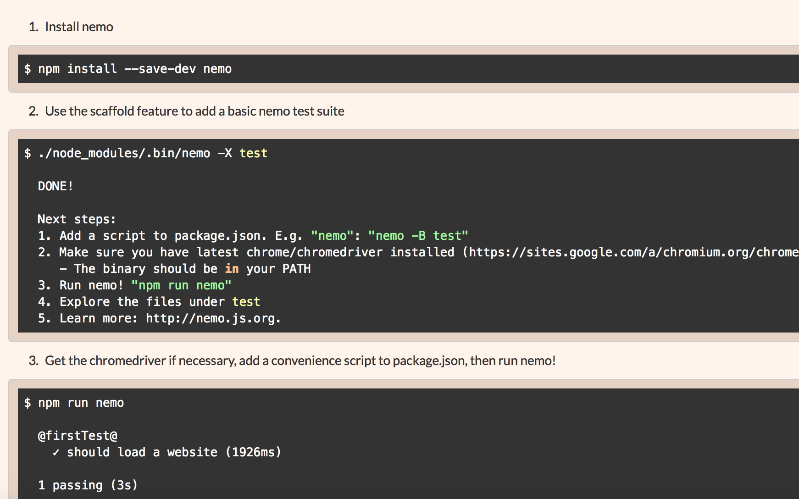
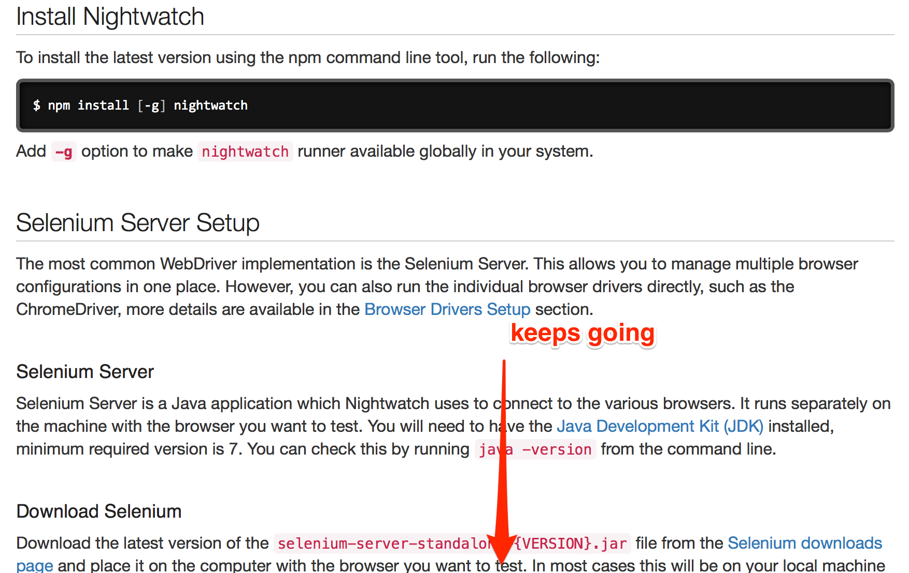

# Nemo vs Nightwatch

Node.js Automation Framework comparison

---

# Nemo Introduction

- uses `selenium-webdriver`
- write mocha tests
- `WebDriver` API available as `this.nemo.driver`
- nemo's "view" abstractions: `this.nemo.view`
- enhanced JSON configuration (confit)
- "popular" at PayPal (~250 github stars)

---

# Nightwatch Introduction

- implements own wire protocol commands
- write built-in, or mocha exports style tests
- API available as argument to test methods
- JSON or JS configuration file
- popular everywhere (~8,000 github stars)

---

# Automation goals

- write tests for positive, negative, experimentation use cases
- data-drive positive and negative use cases
- configure/run tests against local and deployed environments
- breakpoint debugging
- abstract locators into views/page objects

---

# PayFriend Demo

---

# Points of comparison

- documentation/support/community
- ease of installation
- configuration/configurability
- syntax/assertions
- debugging ability
- locator/object abstraction
- reporting
- automation goals achieved

---

# Documentation/Community/Support

---

# Nightwatch

- many questions/answers on stackoverflow
- popular among node.js open source community
- good, complete, single source documentation: [http://nightwatchjs.org](http://nightwatchjs.org)

---

# Nemo

- no open source activity outside of PayPal
- ~~documentation scattered across three READMEs (nemo, nemo-view, nemo-core)~~
- [http://nemo.js.org](http://nemo.js.org) newly updated for `nemo@4`

---

# Documentation/Community/Support (verdict)

## Nightwatch

---

# Ease of installation

---

# Nemo

- CLI install
- CLI setup (`nemo -X`)
- download `chromedriver`

---



---

# Nightwatch

- CLI install
- manual file placement
- download `chromedriver`
- download selenium-standalone

---



---

# Ease of installation (verdict)

## Nemo

- fewer steps
- no standalone server to download/maintain
- scaffold feature

---

# Configuration (verdict)

I like them both. Slight ramp-up in terms of understanding confit's "shortstop handlers" but they can make configuration more efficient.

---

# Configurability (verdict)

## Nemo

Nemo, being based from `selenium-webdriver`, has
- access to its "Capabilities" APIs
- WebDriver API and docs
- more parallel running options

---

# Syntax

Main difference is:
- nightwatch uses chained syntax and inline assertions
- nemo uses async/await, whatever assertion libraries you want to use

---

## Chained syntax

More terse. Easier to read. _Until you want to do something interesting_

## Async/await syntax

Enables debugging. Enables branching (experimentation)

___


# Syntax: verdict

## Depends

For what I've seen at PayPal, Nemo is better

---

# Debugging: Nightwatch

```js
browser
      .click('#addbalink') // can't set breakpoint here
      .waitForElementVisible('#ban', 3000)
      ...
```
```js
browser
      .click('#addbalink', function () {
      	// can set breakpoints here
        console.log('dummy line of code for a breakpoint');
      })
      .waitForElementVisible('#ban', 3000)
      ...
```

Couldn't find instructions on how to breakpoint debug.

---

# Debugging: Nemo

```js
	// set breakpoints anywhere. it's cool.
    await nemo.view._find('#addbalink').click();
    await nemo.view._waitVisible('#ban').sendKeys('0123545332');

```

Just use Node's `--inspect-brk` CLI flag

---

# Debugging (verdict)

Nemo. No need to modify code to breakpoint debug. Use Node's native inspect flag

---

# Locator/Page Object abstraction

---

# Nemo

```js
  it('try adding a credit card', async function () {
    let nemo = this.nemo;
    let {card} = nemo.view;
    await card.form.waitVisible(5000);
    await card.ccn().sendKeys(nemo.data.ccn);

    // do we have the CC type dropdown?
    if (await card.cctype.present()) {
      await card.cctype.optionValue('Misa');
    }
    await card.button().click();
    await nemo.view._waitVisible(nemo.data.result, 5000);
  });
```

---

# Nightwatch

```js
'Should succeed adding a new bank account': function (browser) {
    var bank = browser.page.bank();
    bank
      .to()
      .add('0123545332', '343434', '.result.good');
  },
  'Should fail adding a new bank account': function (browser) {
    var bank = browser.page.bank();
    bank
      .to()
      .add('1001001', '343434', '.result.bad');
  }
```

---

# Locator/Page Object Abstraction (verdict)

## Nightwatch OOTB

---

# BUT

---

```js
const {auth, card, bank} = require('../flow');

describe('PayFriend payment methods', function () {
  beforeEach(auth.login);
  afterEach(auth.logout);

  it('try adding a credit card', async function () {
    await card.to.call(this);
    await card.add.call(this);
  });

  it('should try adding a bank account', async function () {
    await bank.to.call(this);
    await bank.add.call(this);
  });

});

```

---

# ALSO

It would be fairly easy to update `nemo-view` to carry page object functionality

___

# Automation goals

---

# Nightwatch

## could not easily
- parametrize/data-drive
- branch tests for experimentation

---

# Nemo

- All goals achieved

---

# Automation goals (verdict)

## Nemo

---

# Summary

|Category|Nemo|Nightwatch|
|--- |--- |--- |
|**Docs/Community**||**✓**|
|Installation|✓||
|Configuration|✓|✓|
|Configurability|✓||
|Syntax|✓|✓|
|Debugging|✓||
|abstractions||✓|
|reporting|✓||
|goals achieved|✓|~✓|

---

# Summary: continued

- Nemo is currently more popular _at PayPal_
- With some additional OSS activity, Nemo could be popular _outside of PayPal_
  - I spent one weekend updating website, adding link to seleniumhq.com
  - Needs updated open source examples for use within/outside of PayPal


---

# Addendum

[webdriver.io](http://webdriver.io)

---

## Webdriver IO solves some of the nightwatch issues we've found:
- especially debugging/REPL in webdriver

## Webdriver IO still uses selenium-standalone to run

## If I was going to choose between Nightwatch and Webdriver IO, I'd choose Webdriver IO

# References

- [Nightwatch](http://nightwatchjs.org)
- [Nemo](http://nemo.js.org)
- [webdriver.io](http://webdriver.io)
