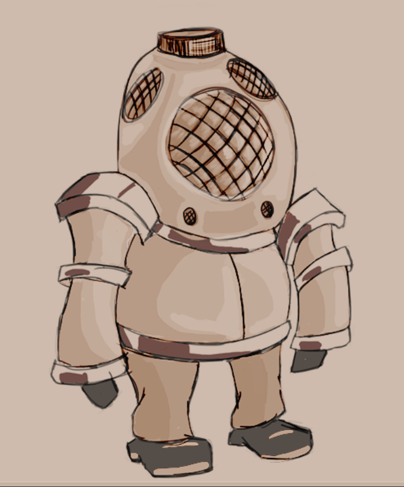
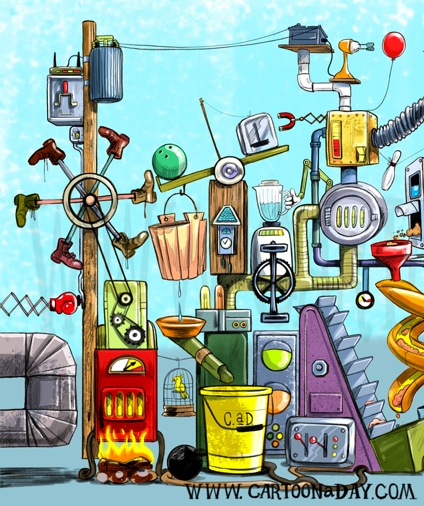
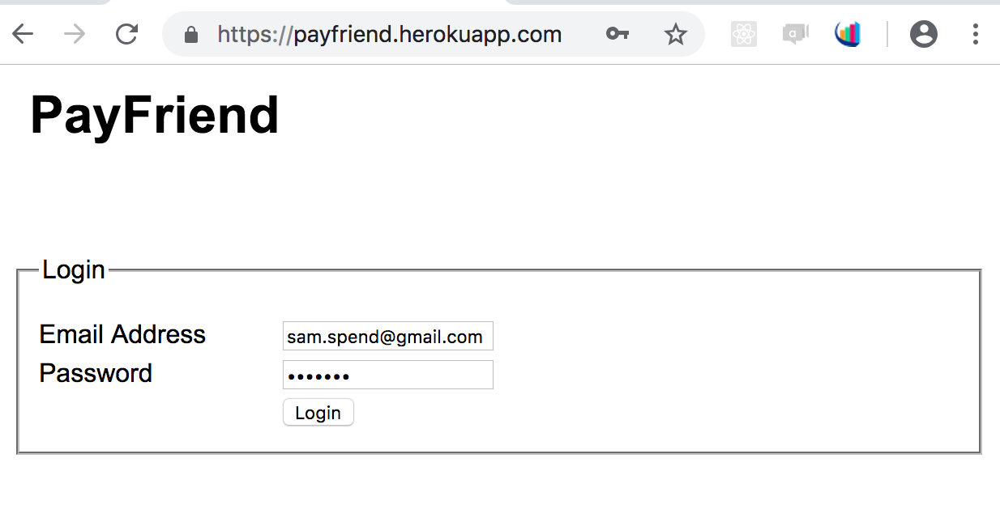
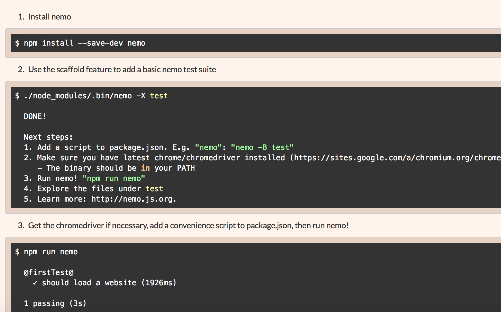
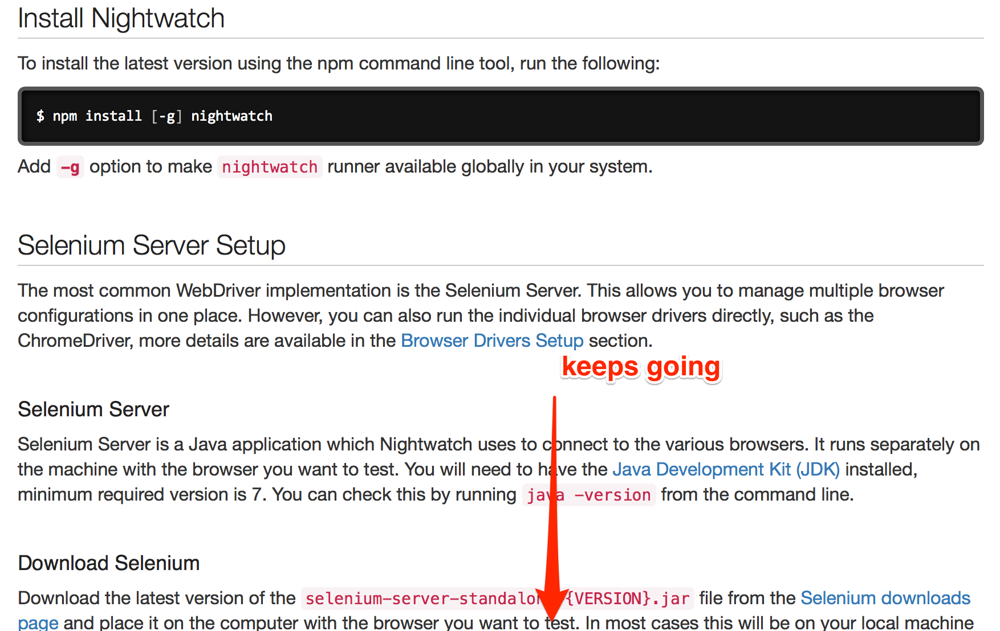
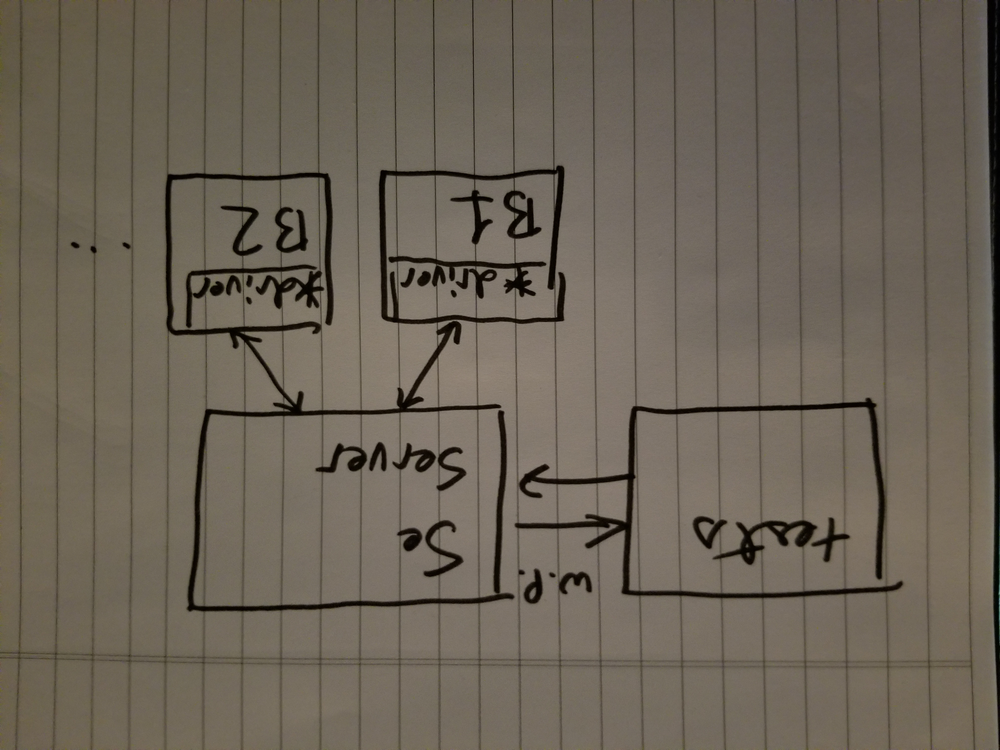
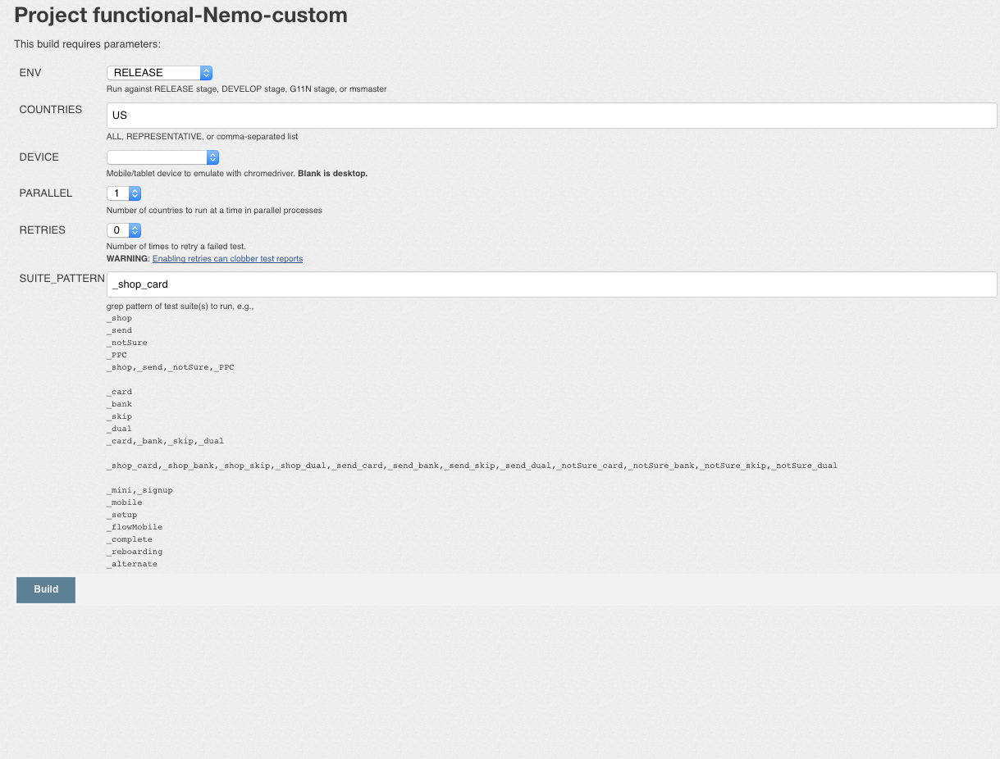

# Nemo vs Nightwatch

Node.js Automation Framework comparison


---

# Thank you for inviting me!!

## eBates/Rakuten

- Vikrant Maniar
- Jigish Mehta


---


---

- At PayPal for 11 years
- Web developer in
  - "maxcode" (1 yr)
  - xslt/C++ (4 yrs)
  - Java (1 yr)
  - node.js (2 yrs)
- node.js Infrastructure engineer (1 yr)
- Infrastructure engineering manager (2 yrs)


---

# Selecting a node.js test framework


---

## [cypress.io](https://www.cypress.io)
## [webdriver.io](http://webdriver.io)
## [nightwatch](http://nightwatchjs.org)
## [nemo](http://nemo.js.org)


---

# Selection criteria

|Category|Framework 1|Framework 2|
|--- |--- |--- |
|Docs/Community|||
|Enterprise support|||
|Installation|||
|Configuration|||
|Configurability|||
|Syntax|||
|Debugging|||
|Abstractions|||
|Reporting|||
|automation goals achieved|||

---

# Nemo vs Nightwatch


---

# Nemo Introduction



---

- uses `selenium-webdriver`
- write mocha tests
- `WebDriver` API available as `this.nemo.driver`
- nemo's "view" abstractions: `this.nemo.view`
- enhanced JSON configuration (confit)
- popular at PayPal (~250 github stars)

---

# Nightwatch Introduction


---

- maintains its own wire protocol commands
- write built-in, or mocha exports style tests
- API available as argument to test methods
- JSON or JS configuration file
- popular (~8,000 github stars)

---

# Automation goals



---

- write tests for positive, negative, experimentation use cases
- data-drive positive and negative use cases
- configure/run tests against local and deployed environments
- breakpoint debugging
- abstract locators into views/page objects
- speed

---



---

# Documentation/Community/Support

---

# Nightwatch

- many questions/answers on stackoverflow
- popular among node.js open source community
- documentation website: [http://nightwatchjs.org](http://nightwatchjs.org)

---

# Nemo

- little open source activity outside of PayPal
- relatively unknown in node.js open source community
- documentation website: [http://nemo.js.org](http://nemo.js.org)

---

# Documentation/Community/Support (verdict)


---

# Enterprise support

- maintained/relied upon for many high-traffic apps at PayPal
- uses `selenium-webdriver`


---

# Ease of installation

---

# Nemo

- CLI install (`npm install nemo`)
- CLI setup (`nemo -X`)
- download `chromedriver`

---



---

# Nightwatch

- CLI install
- manual file placement
- download `chromedriver`
- download selenium-standalone

---



---

# Ease of installation (verdict)

- fewer steps
- no standalone server to download/maintain
- scaffold feature


---

# Selenium processes


---



---


---


---


---


---

# Configuration (verdict)

No preference.

- nightwatch: plain old JS and JSON
- nemo: Slight ramp-up in terms of understanding "shortstop handlers" but boilerplate is reduced

---

# Configurability (verdict)

Nemo, being based from `selenium-webdriver`, has
- access to its "Capabilities" APIs
- WebDriver API and docs
- more parallel running options


---

# Syntax

Main difference is:
- nightwatch uses chained syntax and inline assertions
- nemo uses async/await, whatever assertion libraries you want to use

---

## Chained syntax

More terse. Easier to read. _Until you want to do something interesting_.

## Async/await syntax

Enables debugging. Enables branching (experimentation)

___


# Syntax: verdict

## Nemo

Nemo/Selenium-webdriver synchronous syntax and execution allows for better debugging experience and code branching


---

# Debugging: Nightwatch

```js
browser
      .click('#addbalink') // can't set breakpoint here
      .waitForElementVisible('#ban', 3000)
      ...
```
```js
browser
      .click('#addbalink', function () {
      	// can set breakpoints here
        console.log('dummy line of code for a breakpoint');
      })
      .waitForElementVisible('#ban', 3000)
      ...
```

Couldn't find instructions on how to breakpoint debug.

---

# Debugging: Nemo

```js
	// set breakpoints anywhere. it's cool.
    await nemo.view._find('#addbalink').click();
    await nemo.view._waitVisible('#ban').sendKeys('0123545332');

```

Just use Node's `--inspect-brk` CLI flag

---

# Debugging (verdict)

No need to modify code to breakpoint debug. Use Node's native inspect flag


---

# Locator/Page Object abstraction

---

# Nemo

```js
  it('try adding a credit card', async function () {
    let nemo = this.nemo;
    let {card} = nemo.view;
    await card.form.waitVisible(5000);
    await card.ccn().sendKeys(nemo.data.ccn);

    // do we have the CC type dropdown?
    if (await card.cctype.present()) {
      await card.cctype.optionValue('Misa');
    }
    await card.button().click();
    await nemo.view._waitVisible(nemo.data.result, 5000);
  });
```

---

# Nightwatch

```js
'Should succeed adding a new bank account': function (browser) {
    var bank = browser.page.bank();
    bank
      .to()
      .add('0123545332', '343434', '.result.good');
  },
  'Should fail adding a new bank account': function (browser) {
    var bank = browser.page.bank();
    bank
      .to()
      .add('1001001', '343434', '.result.bad');
  }
```

---

# Locator/Page Object Abstraction (verdict)

## Nightwatch has more structured "page object"


---

# BUT

---

```js
const {auth, card, bank} = require('../flow');

describe('PayFriend payment methods', function () {
  beforeEach(auth.login);
  afterEach(auth.logout);

  it('try adding a credit card', async function () {
    await card.to(this);
    await card.add(this);
  });

  it('should try adding a bank account', async function () {
    await bank.to(this);
    await bank.add(this);
  });

});

```

---

# Reporting

- uses [mochawesome](https://www.npmjs.com/package/mochawesome) (local) or xunit (Jenkins/CI)
- time and tag-based folder structure for historic retention
- screenshots into reports


___

# Automation goals

---

# Nightwatch

## could not easily
- parametrize/data-drive
- branch tests for experimentation

---

# Nemo

- All goals achieved

---

# Automation goals (verdict)


---

# Summary

|Category|Nemo|Nightwatch|
|--- |--- |--- |
|Docs/Community||✓|
|Enterprise support|✓||
|Installation|✓||
|Configuration|✓|✓|
|Configurability|✓||
|Syntax|✓||
|Debugging|✓||
|abstractions||✓|
|reporting|✓||
|goals achieved|✓|~✓|

---

# Summary: continued

- Nemo is currently more popular _at PayPal_
- With some additional OSS activity, Nemo could be popular _outside of PayPal_
  - I spent one weekend updating website, adding link to seleniumhq.com
  - Needs updated open source examples for use within/outside of PayPal
  - Gitter or StackOverflow activity would be a plus


---

# Addendum

---

[webdriver.io](http://webdriver.io)

---

Webdriver IO solves some of the nightwatch issues we've found:

- debugging/REPL in webdriver

Webdriver IO still uses selenium-standalone to run

- If I was going to choose between Nightwatch and Webdriver IO, I'd choose Webdriver IO

---

# [cypress.io](https://www.cypress.io)

---

Cypress.io generates a lot of excitement based on its up front developer experience. But currently does not provide selenium interoperability or browser support beyond Google Chrome. Keep an eye on it!

---

# Nemo: practical usage

---



---
